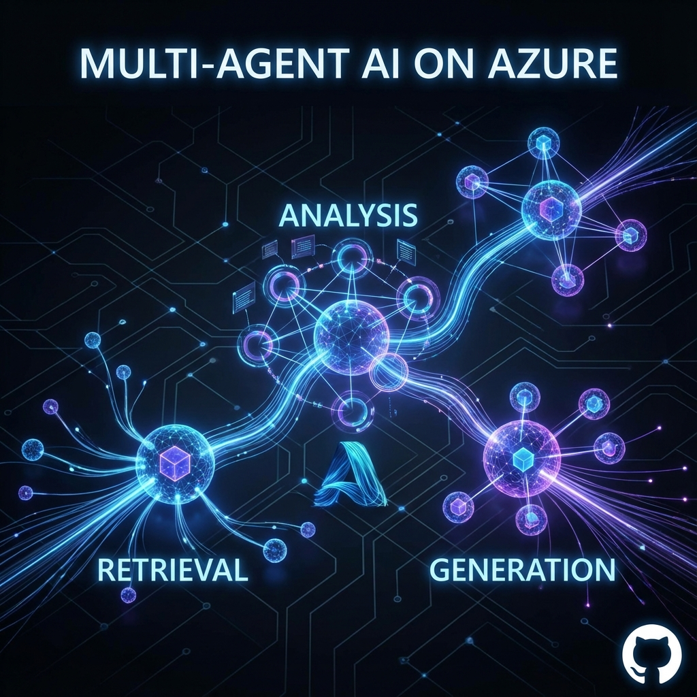
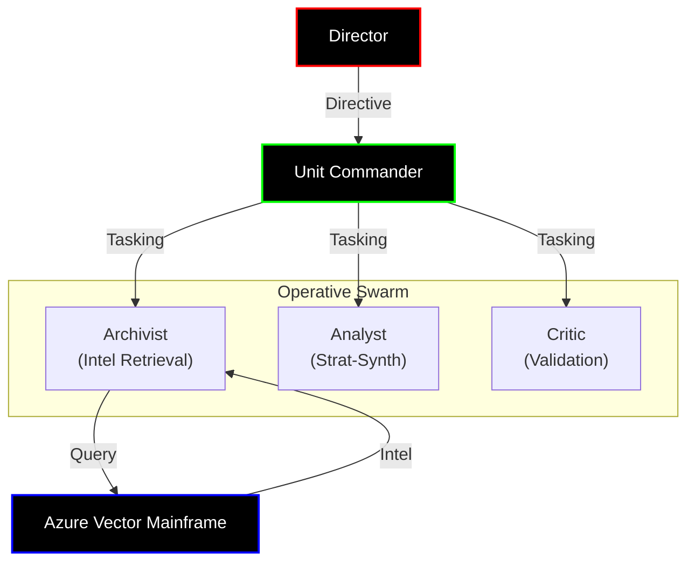

# Azure Agentic RAG Foundry



## Overview

**Azure Agentic RAG Foundry** is a production-ready, multi-agent system designed to leverage the power of **Microsoft Azure AI Search** and **AutoGen**. This project demonstrates how to orchestrate a team of AI agents to retrieve internal knowledge, synthesize strategic insights, and deliver high-quality reports.

The system mimics a "Corporate Intelligence Unit" where distinct specialized agents collaborate to solve complex queries.

## Architecture & Workflow

The system is built on a modular architecture:



### Operative Roles

1.  **The Archivist**: Quantitative retrieval specialist. Authorized to access the **Azure Vector Mainframe** (`search_knowledge_base`) to extract classified documents.
2.  **The Analyst**: Strategic synthesizer. Processes raw intelligence into actionable briefings.
3.  **The Critic**: Counter-intelligence. Validates claims and ensures zero hallucinations in the final dossier.

## Features

*   **Multi-Agent Orchestration**: Uses Microsoft `pyautogen` for robust agent interaction.
*   **RAG Integration**: Direct integration with Azure AI Search for enterprise-grade retrieval.
*   **Production Ready**: Includes configuration management, environment variable handling, and scalable directory structure.
*   **Extensible**: Easily add new agents or tools to the swarm.

## Getting Started

### Prerequisites

*   Python 3.9+
*   Azure OpenAI Service Resource
*   Azure AI Search Resource

### Installation

1.  Clone the repository:
    ```bash
    git clone https://github.com/YOUR_USERNAME/azure-agentic-rag-foundry.git
    cd azure-agentic-rag-foundry
    ```

2.  Install dependencies:
    ```bash
    pip install -r requirements.txt
    ```

3.  Configure environment:
    *   Copy `.env.example` to `.env`.
    *   Fill in your Azure credentials.

    ```bash
    cp .env.example .env
    ```

### Usage

Run the main orchestrator:

```bash
python main.py
```

## Customization

*   **Agents**: Modify `src/agents/definitions.py` to change system prompts or add new agents.
*   **Tools**: Add new tools in `src/tools/` and register them in the agent definitions.
